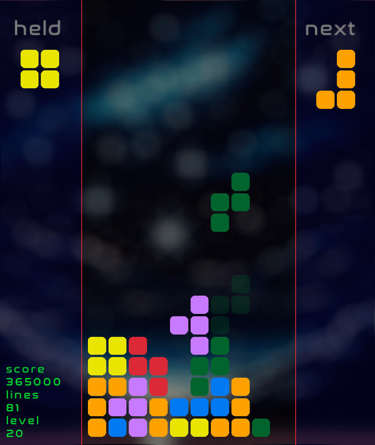

# yazbg
yet another zig block game! 




block games [tm] have always been my goto project for learning a new language. so here we are, my first zig program.
(it started as my first zig program, now it's also has a bunch of claude vibes)

raylib is used for graphics and input
zig-ecs for entities

https://www.raylib.com/
https://github.com/prime31/zig-ecs

## install
```bash
git clone https://github.com/pkdindustries/yazbg
cd yazbg
# native
zig build run
# wasm
zig build -Dtarget=wasm32-emscripten -Doptimize=ReleaseSmall --sysroot <emsdk>

```

## controls
```
  left/right: move
  up: rotate
  z: rotate
  down: drop
  space: hard drop
  c: swap piece
  b: next background
  m: mute
  n: next music
  p: pause
  r: reset
```

tested with zig version: `0.14.0`
