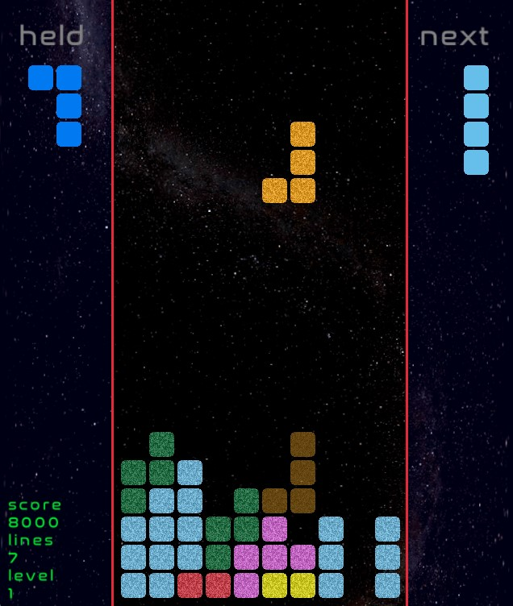

# yazbg
yet another zig block game! 




I realized dad already made one 

https://github.com/andrewrk/tetris/

however, block games [tm] have always been my goto project for learning a new language. so here we are, my first zig program. im still at the stage where i'm casting everything 4 times.

 it mostly trys to follows the Tetris Guideline / SRS rotation.

https://tetris.fandom.com/wiki/Tetris_Guideline

raylib is used for graphics and input handling.

https://www.raylib.com/

## install
```bash
git clone https://github.com/pkdindustries/yazbg
cd yazbg
zig build run
```

## controls
```
l/r arrow keys: move block
up arrow key: rotate block
down arrow key: soft drop
space: hard drop
c: swap block
p: pause
r: restart
```

tested with zig version: `0.12.0-dev.1669+c25f2fa56`
